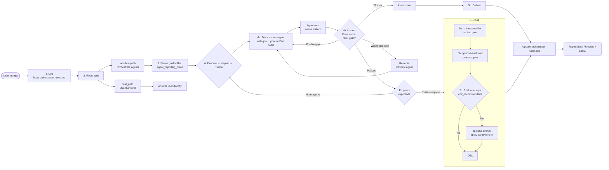
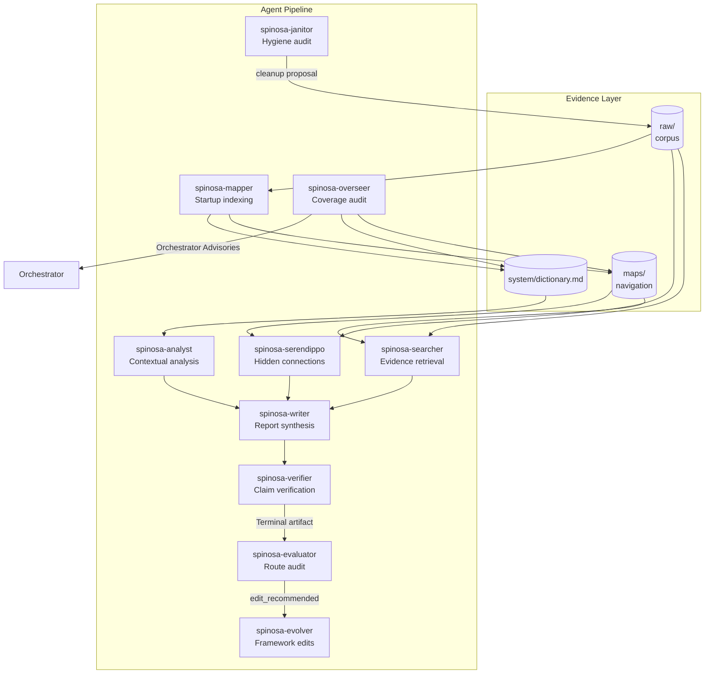
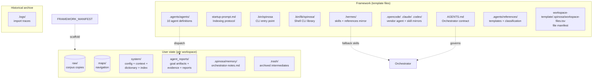
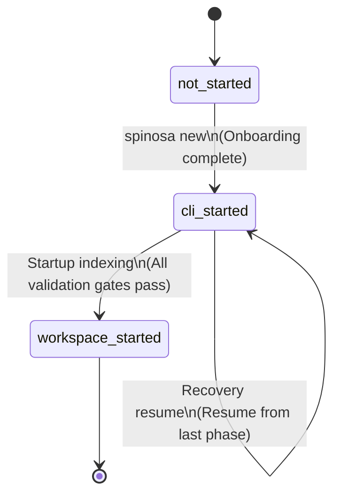
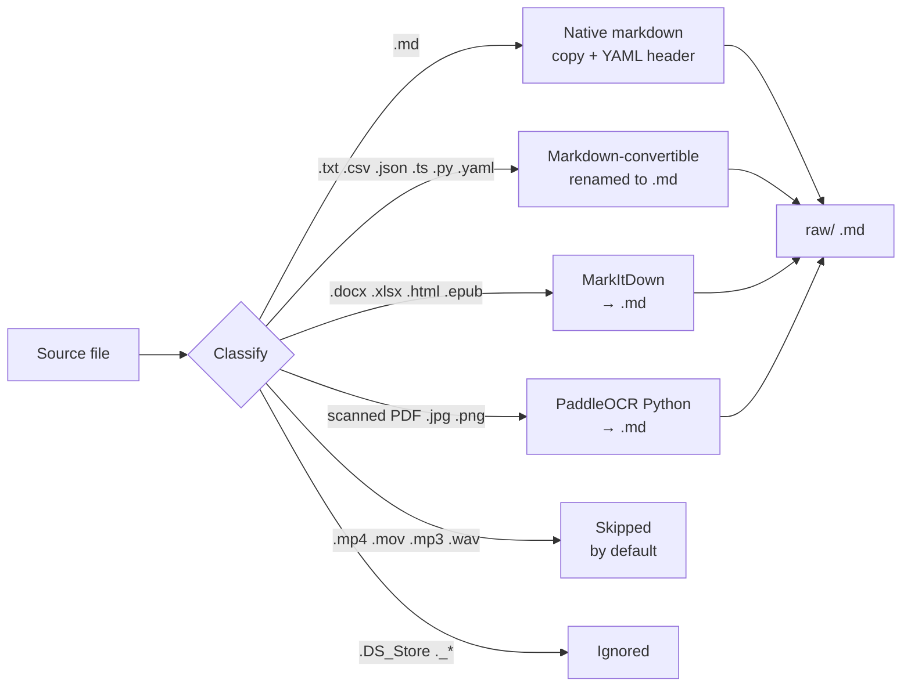
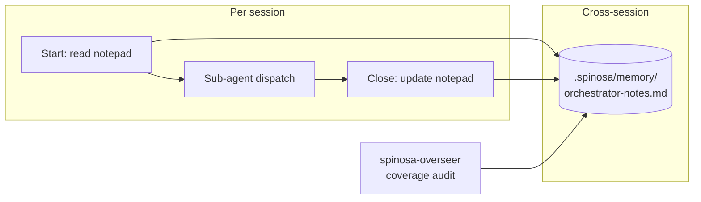

# System Architecture Diagrams

All diagrams are Mermaid — rendered natively by GitHub.

---

## 1. High-Level Harness

```mermaid
flowchart TB
    User([User]) --> CLI[spinosa CLI\n.scan + import + convert]

    subgraph Onboarding ["Phase A: CLI Onboarding"]
        CLI --> FS[Framework-files.tsv scaffold]
        CLI --> SRC[Source scan + classify]
        SRC --> MD[Markdown-native\n.txt .csv .json .ts]
        SRC --> MKD[MarkItDown\n.docx .xlsx .html]
        SRC --> OCR[PaddleOCR Python\nscanned PDF .jpg .png]
        SRC --> SKIP[Audio/video skipped]
        MD & MKD & OCR --> RAW[raw/ corpus .md]
        CLI --> CFG[system/configuration.md\nsetup_status: cli_started]
    end

    subgraph Indexing ["Phase B: Workspace Indexing"]
        direction TB
        ORCH_0[Orchestrator\nreads startup-prompt.md] --> SURVEY[2.1 Survey corpus]
        SURVEY --> BATCH[2.2 Batch files\n20-25 per batch]
        BATCH --> PAR_MAP{2.2 Spawn ALL\nspinosa-mapper\nin parallel}
        PAR_MAP --> M1[Mapper extraction_interviews-batch-001]
        PAR_MAP --> M2[Mapper extraction_policy-pdfs-batch-002]
        PAR_MAP --> MN[Mapper extraction_{batch_id}]
        M1 & M2 & MN --> MERGE[Merge dictionary +\nextraction packets]
        MERGE --> DICT[system/dictionary.md]
        MERGE --> YAML[YAML headers on raw/]
        MERGE --> CTX[Enrich system/context.md]
        DICT --> MAPS[Phase 4 spinosa-mapper map_write]
        MAPS --> HUB[corpus_overview.md\nLevel 0 hub]
        MAPS --> GROUPS[Group maps]
        MAPS --> THEMES[Theme maps]
        MAPS --> SEREN[Phase 5 spinosa-serendippo\nNN_startup-serendipity-*.md]
        SEREN --> VAL[2.7 Validate]
        VAL --> VER[spinosa-verifier\nclaim check]
        VER --> EVAL[spinosa-evaluator\nroute audit]
        EVAL --> DONE[system/configuration.md\nsetup_status: workspace_started]
    end

    RAW --> ORCH_0
```

---

## 2. Orchestrator Loop



---

## 3. Sub-Agent Pipeline



---

## 4. File Layer Architecture



---

## 5. Chain Shapes

```mermaid
flowchart LR
    subgraph Q1 ["Evidence-grounded answer"]
        A1[Goal] --> B1[Searcher]
        B1 --> C1[Writer]
        C1 --> D1[Verifier]
        D1 --> E1[Evaluator]
    end

    subgraph Q2 ["Answer with broader context"]
        A2[Goal] --> B2[Searcher]
        B2 --> C2[Analyst]
        C2 --> D2[Writer]
        D2 --> E2[Verifier]
        E2 --> F2[Evaluator]
    end

    subgraph Q3 ["Hidden connections"]
        A3[Goal] --> B3[Searcher]
        B3 --> C3a[Analyst]
        C3a --> C3[Serendippo]
        C3 --> D3[Writer]
        D3 --> E3[Verifier]
        E3 --> F3[Evaluator]
    end

    subgraph Q4 ["Cleanup audit"]
        A4[Goal] --> B4[Janitor]
        B4 --> C4[Verifier]
        C4 --> D4[Evaluator]
    end

    subgraph Q5 ["Periodic coverage"]
        A5[Goal] --> B5[Overseer]
        B5 --> C5[Evaluator]
    end
```



---

## 6. Configuration State Machine



---

## 7. File Classification Pipeline



---

## 8. Orchestrator Notepad Data Flow



---

## 9. Sub-Agent Gateway

```mermaid
flowchart TB
    ORCH2[Orchestrator] --> TRY{Try native spawn}

    TRY -->|Available| NATIVE_SPAWN[Native sub-agent\ntool dispatch]
    NATIVE_SPAWN --> ARTIFACT[Writes artifact\nagent_reports/*_{session_id}.md\nor NN_*.md]
    ARTIFACT --> GATE{Evaluate gate}

    TRY -->|Unavailable| TASK[Task-tool spawn\nCursor / Grok]
    TASK --> INJECT2[Inject .agents/agents/name.md\nas Task prompt]
    INJECT2 --> ARTIFACT

    TRY -->|Hermes host| HERMES_D[delegate_task or\n/spinosa-agent skill]
    HERMES_D --> ARTIFACT

    TRY -->|Fails| FALLBACK[Read fallback\n.agents/agents/name.md\nor .hermes/skills/*/SKILL.md]
    FALLBACK --> INJECT[Inject instruction body]
    INJECT --> FALLBACK_SPAWN[Sub-agent via\nvendor tool]
    FALLBACK_SPAWN --> ARTIFACT

    GATE -->|Pass| LOG[Append Route Decision\nto g_{session_id}.md]
    LOG --> DONE2(Done)
    GATE -->|Fail, fixable| RETRY[Retry same agent\nmax 2 times]
    GATE -->|Fail, direction| REROUT2[Re-route]
    GATE -->|Timeout| RETRY_TIGHT[Retry tightened scope\nor abort]

    RETRY --> TRY
    REROUT2 --> TRY
    RETRY_TIGHT --> TRY
```
