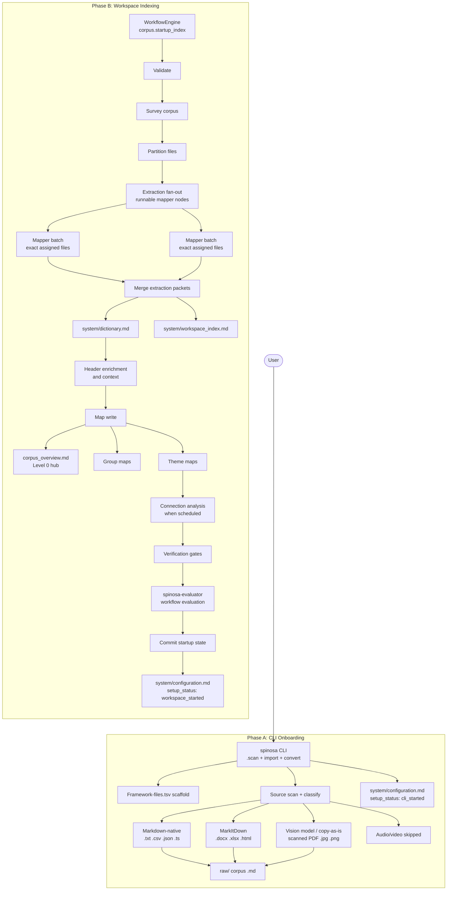
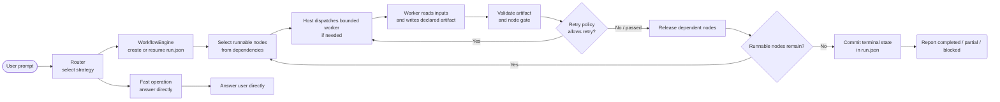
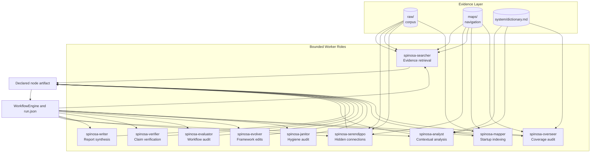
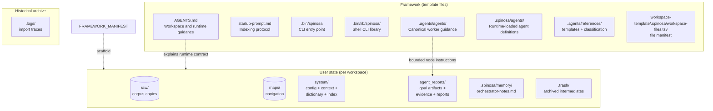
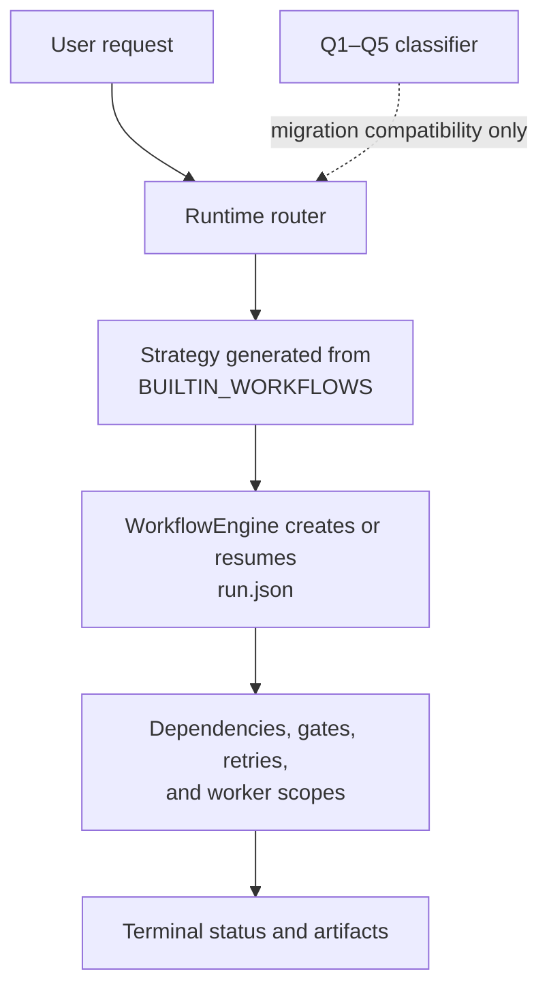
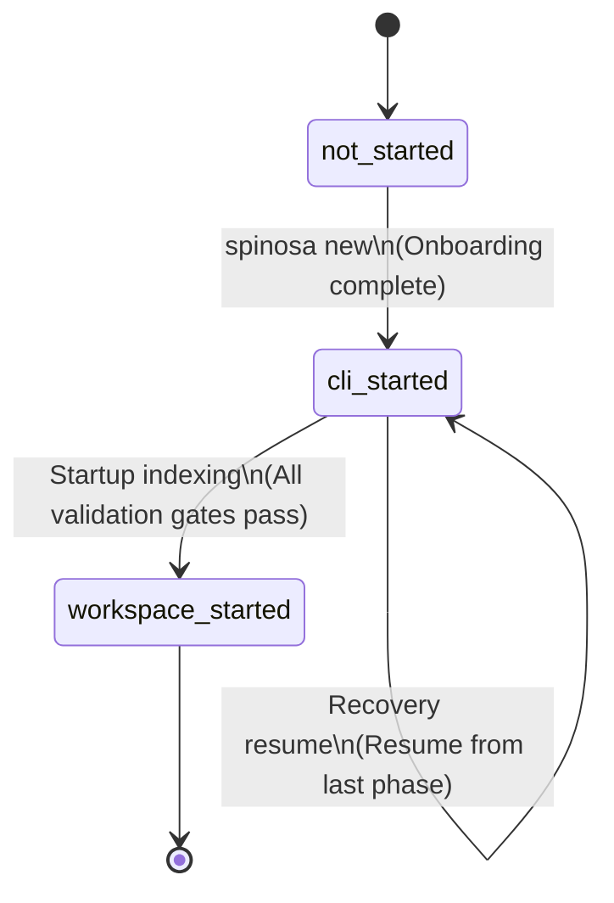
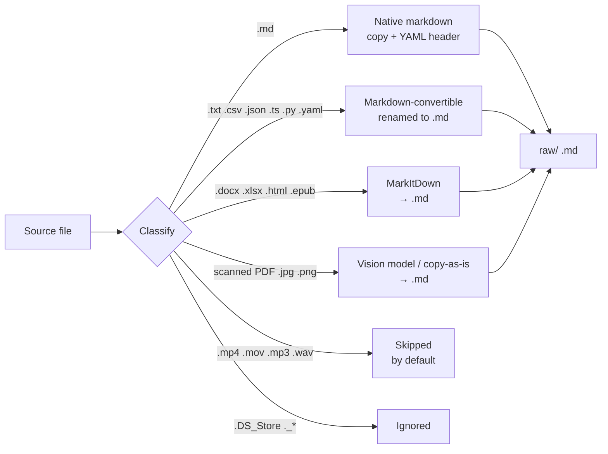
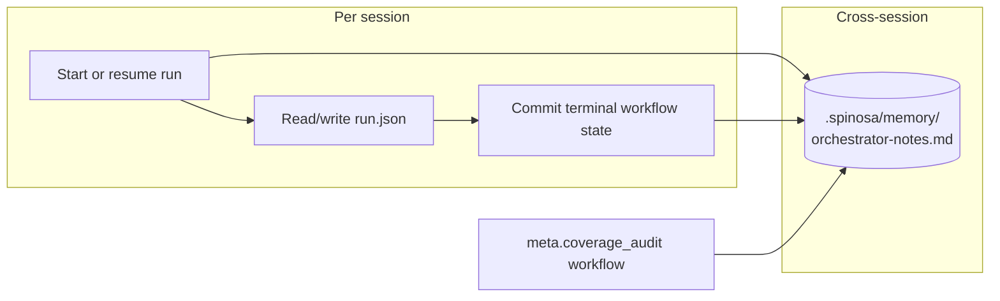
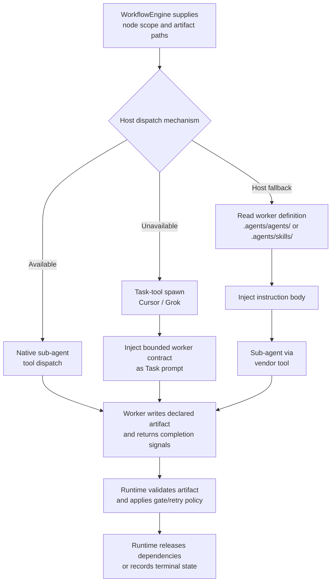

# System Architecture Diagrams

All diagrams are Mermaid — rendered natively by GitHub.

---

## 1. High-Level Harness

```mermaid
flowchart TB
    User([User]) --> CLI[spinosa CLI\n.scan + import + convert]

    subgraph Onboarding ["Phase A: CLI Onboarding"]
        CLI --> FS[Framework-files.tsv scaffold]
        CLI --> SRC[Source scan + classify]
        SRC --> MD[Markdown-native\n.txt .csv .json .ts]
        SRC --> MKD[MarkItDown\n.docx .xlsx .html]
        SRC --> OCR[Vision model / copy-as-is\nscanned PDF .jpg .png]
        SRC --> SKIP[Audio/video skipped]
        MD & MKD & OCR --> RAW[raw/ corpus .md]
        CLI --> CFG[system/configuration.md\nsetup_status: cli_started]
    end

    subgraph Indexing ["Phase B: Workspace Indexing"]
        direction TB
        ENGINE[WorkflowEngine\ncorpus.startup_index] --> VALIDATE[Validate]
        VALIDATE --> SURVEY[Survey corpus]
        SURVEY --> PARTITION[Partition files]
        PARTITION --> FANOUT[Extraction fan-out\nrunnable mapper nodes]
        FANOUT --> M1[Mapper batch\nexact assigned files]
        FANOUT --> M2[Mapper batch\nexact assigned files]
        M1 & M2 --> MERGE[Merge extraction packets]
        MERGE --> DICT[system/dictionary.md]
        MERGE --> INDEX[system/workspace_index.md]
        DICT --> ENRICH[Header enrichment\nand context]
        ENRICH --> MAPS[Map write]
        MAPS --> HUB[corpus_overview.md\nLevel 0 hub]
        MAPS --> GROUPS[Group maps]
        MAPS --> THEMES[Theme maps]
        THEMES --> CONNECTIONS[Connection analysis\nwhen scheduled]
        CONNECTIONS --> VER[Verification gates]
        VER --> EVAL[spinosa-evaluator\nworkflow evaluation]
        EVAL --> COMMIT[Commit startup state]
        COMMIT --> DONE[system/configuration.md\nsetup_status: workspace_started]
    end

```

---

## 2. Runtime Workflow Loop

```mermaid
flowchart LR
    PROMPT([User prompt]) --> ROUTER[Router\nselect strategy]

    ROUTER --> FAST[Fast operation\nanswer directly]
    ROUTER --> ENGINE[WorkflowEngine\ncreate or resume run.json]

    ENGINE --> RUNNABLE[Select runnable nodes\nfrom dependencies]
    RUNNABLE --> DISPATCH[Host dispatches bounded worker\nif needed]
    DISPATCH --> EXECUTE[Worker reads inputs\nand writes declared artifact]
    EXECUTE --> INSPECT[Validate artifact\nand node gate]
    INSPECT --> RETRY{Retry policy\nallows retry?}
    RETRY -->|Yes| DISPATCH
    RETRY -->|No / passed| RELEASE[Release dependent nodes]
    RELEASE --> MORE{Runnable nodes remain?}
    MORE -->|Yes| RUNNABLE
    MORE -->|No| TERMINAL[Commit terminal state\nin run.json]

    FAST --> ANS[Answer user directly]
    TERMINAL --> DONE_DELIVER(Report completed / partial / blocked)
```

---

## 3. Runtime-Selected Worker Nodes

```mermaid
flowchart TB
    subgraph Evidence ["Evidence Layer"]
        RAW[(raw/\ncorpus)]
        MAPS[(maps/\nnavigation)]
        DICT[(system/dictionary.md)]
    end

    subgraph Agents ["Bounded Worker Roles"]
        SEARCH[spinosa-searcher\nEvidence retrieval]
        ANALYST[spinosa-analyst\nContextual analysis]
        SEREN2[spinosa-serendippo\nHidden connections]
        WRITER[spinosa-writer\nReport synthesis]
        VERIFIER[spinosa-verifier\nClaim verification]
        EVALUATOR[spinosa-evaluator\nWorkflow audit]
        EVOLVER[spinosa-evolver\nFramework edits]
        JANITOR[spinosa-janitor\nHygiene audit]
        MAPPER[spinosa-mapper\nStartup indexing]
        OVERSEER[spinosa-overseer\nCoverage audit]
    end

    RAW --> SEARCH
    MAPS --> SEARCH
    MAPS --> SEREN2
    RAW --> SEREN2
    DICT --> ANALYST
    ENGINE[WorkflowEngine and run.json] --> SEARCH
    ENGINE --> ANALYST
    ENGINE --> SEREN2
    ENGINE --> WRITER
    ENGINE --> VERIFIER
    ENGINE --> EVALUATOR
    ENGINE --> EVOLVER
    ENGINE --> JANITOR
    ENGINE --> MAPPER
    ENGINE --> OVERSEER
    RAW & MAPS --> SEARCH
    RAW --> SEREN2
    DICT --> ANALYST
    RAW --> MAPPER
    MAPS --> MAPPER
    MAPS --> OVERSEER
    DICT --> OVERSEER
    SEARCH --> OUT[Declared node artifact]
    ANALYST --> OUT
    SEREN2 --> OUT
    WRITER --> OUT
    VERIFIER --> OUT
    EVALUATOR --> OUT
    EVOLVER --> OUT
    JANITOR --> OUT
    MAPPER --> OUT
    OVERSEER --> OUT
    OUT --> ENGINE
```

---

## 4. File Layer Architecture

```mermaid
flowchart TB
    subgraph Framework ["Framework (template files)"]
        AGENTS[AGENTS.md\nWorkspace and runtime guidance]
        STARTUP[startup-prompt.md\nIndexing protocol]
        CLI_BIN[.bin/spinosa\nCLI entry point]
        SRC[.bin/lib/spinosa/\nShell CLI library]
        DEF[.agents/agents/\nCanonical worker guidance]
        RUNTIME_AGENTS[.spinosa/agents/\nRuntime-loaded agent definitions]
        REF[.agents/references/\ntemplates + classification]
        FILES[workspace-template/.spinosa/workspace-files.tsv\nfile manifest]
    end

    subgraph UserState ["User state (per workspace)"]
        RAW2[(raw/\ncorpus copies)]
        MAPS2[(maps/\nnavigation)]
        SYS[system/\nconfig + context +
        dictionary + index]
        REPORTS[agent_reports/\ngoal artifacts +
        evidence + reports]
        MEMORY[.spinosa/memory/\norchestrator-notes.md]
        TRASH[.trash/\narchived intermediates]
    end

    subgraph Logs ["Historical archive"]
        LOGS[.logs/\nimport traces]
    end

    FRAMEWORK_MANIFEST -.->|scaffold| UserState
    DEF -.->|bounded node instructions| REPORTS
    AGENTS -.->|explains runtime contract| UserState
```

---

## 5. Workflow Strategy Selection

```mermaid
flowchart TB
    PROMPT[User request] --> ROUTER[Runtime router]
    ROUTER --> STRATEGY[Strategy generated from\nBUILTIN_WORKFLOWS]
    STRATEGY --> RUN[WorkflowEngine creates or resumes\nrun.json]
    RUN --> NODES[Dependencies, gates, retries,\nand worker scopes]
    NODES --> RESULT[Terminal status and artifacts]
    LEGACY[Q1–Q5 classifier] -. migration compatibility only .-> ROUTER
```

---

## 6. Configuration State Machine

```mermaid
stateDiagram-v2
    [*] --> not_started
    not_started --> cli_started: spinosa new\n(Onboarding complete)
    cli_started --> workspace_started: Startup indexing\n(All validation gates pass)
    cli_started --> cli_started: Recovery resume\n(Resume from last phase)
    workspace_started --> [*]
```

---

## 7. File Classification Pipeline

```mermaid
flowchart LR
    SRC[Source file] --> CLASS{Classify}
    CLASS -->|.md| NATIVE[Native markdown\ncopy + YAML header]
    CLASS -->|.txt .csv .json .ts .py .yaml| MD_CONV[Markdown-convertible\nrenamed to .md]
    CLASS -->|.docx .xlsx .html .epub| MKD2[MarkItDown\n→ .md]
    CLASS -->|scanned PDF .jpg .png| OCR2[Vision model / copy-as-is\n→ .md]
    CLASS -->|.mp4 .mov .mp3 .wav| SKIP2[Skipped\nby default]
    CLASS -->|.DS_Store ._*| IGNORE[Ignored]

    NATIVE & MD_CONV & MKD2 & OCR2 --> RAW3[raw/ .md]
```

---

## 8. Workflow State and Memory

```mermaid
flowchart LR
    subgraph Session ["Per session"]
        START[Start or resume run] --> STATE[Read/write run.json]
        STATE --> CLOSE2[Commit terminal workflow state]
    end

    subgraph Persistence ["Cross-session"]
        NOTES2[(.spinosa/memory/\norchestrator-notes.md)]
    end

    START --> NOTES2
    CLOSE2 --> NOTES2
    AUDIT[meta.coverage_audit workflow] --> NOTES2
```

---

## 9. Host Worker Dispatch

```mermaid
flowchart TB
    ENGINE2[WorkflowEngine supplies\nnode scope and artifact paths] --> TRY{Host dispatch mechanism}

    TRY -->|Available| NATIVE_SPAWN[Native sub-agent\ntool dispatch]
    NATIVE_SPAWN --> ARTIFACT[Worker writes declared artifact\nand returns completion signals]
    ARTIFACT --> ENGINE_GATE[Runtime validates artifact\nand applies gate/retry policy]

    TRY -->|Unavailable| TASK[Task-tool spawn\nCursor / Grok]
    TASK --> INJECT2[Inject bounded worker contract\nas Task prompt]
    INJECT2 --> ARTIFACT

    TRY -->|Host fallback| FALLBACK[Read worker definition\n.agents/agents/ or .agents/skills/]
    FALLBACK --> INJECT[Inject instruction body]
    INJECT --> FALLBACK_SPAWN[Sub-agent via\nvendor tool]
    FALLBACK_SPAWN --> ARTIFACT

    ENGINE_GATE --> RELEASE2[Runtime releases dependencies\nor records terminal state]
```
